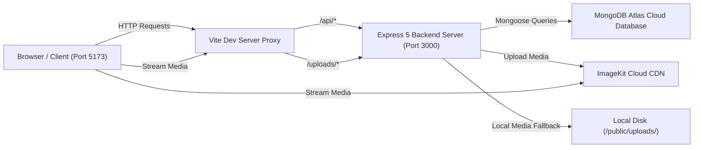

# System Architecture Specification — Zesty Platform

This document specifies the technical architecture, data flows, proxy design, and security architecture of the Zesty full-stack platform.

---

## 1. System High-Level Topology



---

## 2. Component Layering

### 2.1 Frontend Layer (React 19 + Vite)
- **Single Page Application (SPA)**: Rendered dynamically with custom tab/modal views without heavy router reloads.
- **State Management**:
  - `session`: User authentication context loaded via `GET /api/auth/me`.
  - `cart`: Unauthenticated guest cart (`localStorage`) or DB cart (`GET /api/cart`).
  - `foods`: Feed state populated via `GET /api/food`.
  - `orders`: Live order state populated via socket events and HTTP requests.
- **Reverse Proxy**: Vite proxy forwards `/api` and `/uploads` requests to `http://127.0.0.1:3000` to prevent CORS issues and cross-origin cookie drops.

### 2.2 Backend Layer (Node.js + Express 5)
- **Security Middleware Chain**:
  1. `helmet`: Sets HTTP security headers (CSP, HSTS, Frameguard, XSS filter).
  2. `cors`: Dynamic allowed origin checking with credential support.
  3. `cookieParser`: Signed HTTP-only cookie parsing (`zesty_session`).
  4. `customMongoSanitize`: In-place recursive MongoDB operator sanitization (`$` and `.` stripping).
  5. `hpp`: HTTP Parameter Pollution prevention.
- **Authentication & RBAC**:
  - `authMiddleware.authUser`: Validates JWT token from signed cookie or Authorization header.
  - Role-specific guards: `authFoodPartnerMiddleware`, `authDeliveryMiddleware`, `authAdminMiddleware`.
- **Media Engine**:
  - `storage.services.js`: Attempts ImageKit API upload. If test keys or unconfigured keys are present, saves the intact binary file to `backend/public/uploads/` and returns public static path `/uploads/${fileName}`.

### 2.3 Database Layer (MongoDB Atlas)
- **Cloud MongoDB Cluster**: Multi-tenant database storing collections:
  - `users`: Customers and general accounts.
  - `foodpartners`: Restaurant profiles, location coordinates, ratings.
  - `deliverypartners`: Rider profiles, vehicle info, earnings.
  - `admins`: Super admin accounts.
  - `foods`: Dish items, price, category, media URLs (`video`, `image`, `mediaType`).
  - `orders`: Order status tracking, items, breakdown, delivery address.
  - `carts`: User carts with items array and subtotal.
  - `addresses`: Saved customer delivery locations.
  - `auditlogs`: Security audit logs.

---

## 3. Communication & Proxy Specifications

- **Development Ports**:
  - Frontend SPA: `http://localhost:5173`
  - Backend API: `http://127.0.0.1:3000`
- **Proxy Contract** (`frontend/vite.config.js`):
  ```javascript
  server: {
    port: 5173,
    proxy: {
      '/api': {
        target: 'http://127.0.0.1:3000',
        changeOrigin: true,
        secure: false
      },
      '/uploads': {
        target: 'http://127.0.0.1:3000',
        changeOrigin: true,
        secure: false
      }
    }
  }
  ```
