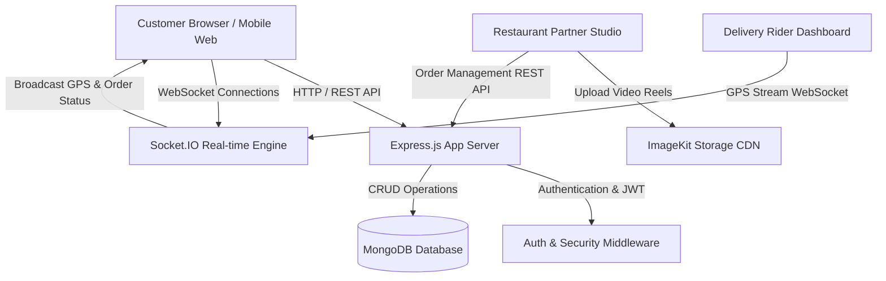

# Zesty — Short-Form Food Reels & Hyper-Local Delivery Platform

Zesty is a full-stack, multi-role enterprise web application that revolutionizes food discovery by blending Instagram-style vertical video reels with hyper-local 15-minute food delivery. Instead of browsing traditional static text menus, customers discover appetizing dishes through short video films created directly by local chefs and kitchens, add items to cart directly from the video stream, and track real-time kitchen preparation and live GPS delivery.

---

## Overview

Zesty bridges the gap between viral food content and immediate consumption. Traditional food delivery apps rely on static images and text menus; Zesty turns food discovery into a visual, interactive experience.

### The Core Experience:
1. **Food Reel Discovery**: Customers scroll through vertical video reels highlighting freshly prepared dishes.
2. **Instant Carting & Customization**: Food items can be added directly from the video overlay with customization options and packaging charges.
3. **Smart Cart & Single-Kitchen Enforcement**: Ensures optimal delivery speed by validating items against a single food partner (with cart conflict resolution).
4. **Checkout & Geolocation**: Multi-address management with automated financial breakdown (GST, packaging, delivery fee, platform fee, and coupon discounts).
5. **Kitchen Acceptance & Preparation**: Real-time order status updates pushed to the restaurant partner's dashboard.
6. **Live GPS Delivery Tracking**: Automated delivery partner assignment, real-time Socket.IO GPS location streaming, delivery verification OTP, and live order status progression.

---

## Features

### 1. Customer Experience
- **Vertical Food Reel Stream**: Autoplaying short food films with sound toggle, video play/pause controls, like animation, and creator profile popups.
- **Social Profile & Reels**: Public user/creator profiles displaying follower/following counts, custom bio, published food reels grid, and liked dishes grid.
- **Restaurant Discovery**: Dedicated restaurant profile pages featuring rating, cuisine type, address, live status indicator (Online/Offline), menu catalog, and restaurant-specific reel feeds.
- **Search & Category Filtering**: Instant client/server search across dishes, food partners, and categories (Trending, Fast Food, Dessert, Healthy, Drinks, Spicy).
- **Guest & Authenticated Cart**: Guest cart stored in `localStorage` that seamlessly merges into the user's database cart upon registration or login.
- **Cart Conflict Resolution**: Smart warning modal when attempting to add items from a different restaurant, offering one-click cart replacement.
- **Address & Geolocation System**: Saved addresses (Home, Office, Hostel, Friend, Other) with exact latitude/longitude coordinates and custom delivery instructions.
- **Checkout & Financial Transparency**: Full price breakdown showing Food Subtotal, Packaging Charge, 5% GST, Delivery Fee, Platform Fee, Coupon Discounts, and Final Grand Total.
- **Coupon & Promo Engine**: Support for flat and percentage-based promo codes with minimum order value validation.
- **Live Socket.IO Order Tracker**: Real-time tracking screen displaying order timeline (Placed → Accepted → Preparing → Ready → Assigned Rider → Picked Up → Out for Delivery → Delivered), live rider GPS coordinates on map, delivery verification OTP, and quick call actions.
- **Order Rating & Reviews**: Post-delivery rating system for food quality, delivery speed, and restaurant experience.

### 2. Restaurant Partner System
- **Partner Studio Dashboard**: Specialized operational portal for restaurant owners and chefs.
- **Video Reel Publishing**: Direct video upload service using ImageKit cloud storage integration, thumbnail generator, price setting, category assignment, and packaging fee configuration.
- **Live Store Status Control**: One-click toggle between `Online` (accepting orders) and `Offline`.
- **Kitchen Order Management**: Real-time incoming order stream with status progression buttons (`Accept Order` → `Mark as Preparing` → `Mark as Ready for Pickup`).
- **Revenue Analytics & Earnings**: Live tracking of total revenue, monthly income, food subtotals, packaging fee collections, and net earnings after platform commission.
- **Menu Management**: Ability to view all published dishes and delete items.

### 3. Delivery Partner System
- **Rider Workspace Dashboard**: Dedicated portal for delivery personnel.
- **Duty Status Toggle**: Switch between `Online`, `Offline`, and `Busy` states.
- **Order Assignment & Acceptance**: Incoming order notifications showing pickup restaurant location, customer delivery address, distance, and earnings payout.
- **Live GPS Broadcast**: Real-time geolocation stream transmitted via WebSockets (`update_live_location`) to the customer's tracking screen.
- **Delivery Progress Control**: Step-by-step order handling (`Accept Delivery` → `Mark Picked Up` → `Out for Delivery` → `Complete Delivery with Customer OTP`).
- **Earnings & Payout Ledger**: Today's earnings, weekly earnings, monthly income, total completed deliveries, and per-trip financial breakdown (5% customer total commission).

### 4. Platform Admin System
- **Super Admin Control Panel**: Centralized management interface for platform administrators.
- **Dashboard Metrics**: Global platform analytics including total users, total restaurants, active delivery partners, total orders, global gross merchandise value (GMV), and net platform commission revenue.
- **Partner Verification & Approval**: Review and approve/reject pending restaurant partner applications (FSSAI, GST, license) and delivery partner applications (Driving License, Aadhaar, Vehicle details).
- **User & Order Supervision**: Search and manage registered accounts, update user status, and inspect or modify any platform order status.
- **Platform System Settings**: Global configuration for base delivery fee, tax percentage, platform commission percentage, and banner announcements.

---

## Architecture & Data Flow



### Flow Breakdown:
1. **Discovery & Cart**: Customer views video reels fetched from `/api/food` → adds items to `/api/cart`.
2. **Order Placement**: Customer selects saved address from `/api/address` and submits order to `/api/orders/checkout` → Server runs `pricing.service.js` to compute immutable price snapshots and financial commission ledgers.
3. **Kitchen Notification**: Order is saved with status `Placed` → Appears instantly on Restaurant Partner Dashboard `/api/orders/restaurant/incoming`.
4. **Rider Assignment & Dispatch**: Kitchen accepts order (`Preparing` → `Ready`) → Order becomes available on Delivery Dashboard `/api/delivery/orders` → Rider accepts and updates location via Socket.IO `update_live_location`.
5. **Customer Live Tracking**: Customer's `OrderStatusTracker` listens to Socket.IO events `order_status_changed` and `rider_location_updated` until order completion.

---

## Financial Settlement & Commission Model

Zesty features a server-side financial settlement engine (`backend/src/services/pricing.service.js`) enforcing transparent commission splits:

- **Customer Total**:
  $$\text{Customer Total} = \text{Food Subtotal} + \text{Packaging Fee} + \text{GST (5\%)} + \text{Delivery Fee} + \text{Platform Fee} - \text{Discount}$$

- **Platform Commission**:
  $$\text{Platform Commission} = 5\% \times \text{Food Subtotal}$$

- **Restaurant Net Earnings**:
  $$\text{Restaurant Earnings} = (\text{Food Subtotal} - \text{Platform Commission}) + \text{Packaging Fee}$$

- **Delivery Partner Earnings**:
  $$\text{Delivery Commission} = 5\% \times \text{Customer Total}$$

---

## Tech Stack

### Frontend
- **Framework**: React 19 (`react`, `react-dom`)
- **Build Tool**: Vite 8
- **Styling**: Modern Vanilla CSS with dark mode tokens, glassmorphism, responsive grid, and custom micro-animations
- **Real-Time Communication**: Socket.io-client 4
- **OAuth & Messaging**: `@react-oauth/google`, `@emailjs/browser`
- **Icons**: Lucide React (`lucide-react`)
- **Linter**: Oxlint (`oxlint`)

### Backend
- **Runtime & Framework**: Node.js, Express.js 5
- **Database Engine**: MongoDB with Mongoose 9 ODM
- **Real-Time Socket Server**: Socket.IO 4
- **Security & Headers**: Helmet 8, Express Rate Limit 8, Express Mongo Sanitize 2, HPP (HTTP Parameter Pollution), CORS, Cookie Parser
- **Authentication**: JSON Web Tokens (`jsonwebtoken`), `bcryptjs`, `google-auth-library`
- **File Upload & Cloud Storage**: Multer 2, ImageKit Node.js SDK (`@imagekit/nodejs`)
- **Email Notifications**: Nodemailer 9

---

## Database Models & Collections

Zesty utilizes 15 MongoDB collections:

| Collection / Model | Description & Key Fields | Relationships |
| :--- | :--- | :--- |
| **`User`** (`user`) | Customer accounts storing name, email, password, phone, Google ID, bio, avatar, followers, following. | Refers to `user` (followers/following) |
| **`FoodPartner`** (`foodpartner`) | Restaurant partner accounts storing restaurant details, FSSAI/GST details, approval status, rating, location coordinates, packaging charge. | Referenced by `Food`, `Order`, `Cart` |
| **`DeliveryPartner`** (`DeliveryPartner`) | Delivery rider accounts storing license, vehicle info, approval status, duty status (`online`/`offline`/`busy`), live coordinates, total earnings. | Referenced by `Order` |
| **`Admin`** (`Admin`) | Super Admin and Manager accounts with administrative permissions and access controls. | System management |
| **`Food`** (`food`) | Food reel items storing dish name, mediaType (`video`/`image`), video URL, ImageKit fileId, price, packaging charge, category, availability. | Belongs to `foodpartner` |
| **`Cart`** (`Cart`) | Active cart per user storing cart items, customizations, foodPartner reference, and subtotal. | Unique to `user`, references `food` & `foodpartner` |
| **`Order`** (`Order`) | Complete order ledger storing order number, items array with immutable price snapshots, delivery address, financial breakdown, payment method/status, delivery OTP, status timeline. | References `user`, `foodpartner`, `DeliveryPartner`, `food` |
| **`Address`** (`Address`) | Saved delivery addresses per user with label, contact details, pincode, and lat/lng coordinates. | Belongs to `user` |
| **`Coupon`** (`Coupon`) | Promotional discount codes storing code, discountType (`percentage`/`flat`), discountValue, minOrderValue, maxDiscount, expiry date. | Applied on `Order` |
| **`Review`** (`Review`) | User ratings and text reviews for food items and food partners. | References `user`, `food`, `foodpartner` |
| **`Session`** (`Session`) | Refresh token sessions tracking user device info, IP, browser, OS, and last active timestamp. | References `user` |
| **`AuditLog`** (`AuditLog`) | Security audit log capturing administrative actions, IP address, device specs, and timestamps. | Multi-role tracking |
| **`Settings`** (`Settings`) | Platform configuration storing categories list, base delivery charges, tax rate, platform commission %, and FAQs. | Global platform config |
| **`Otp`** (`Otp`) | One-time passwords for phone/email verification and password resets. | Verification engine |
| **`Notification`** (`Notification`) | In-app alerts for order updates and system messages. | References `user` |

---

## Project Structure

```text
Zesty/
├── backend/
│   ├── server.js                 # HTTP Server & Socket.IO initialization
│   ├── package.json              # Backend dependencies & scripts
│   └── src/
│       ├── app.js                # Express app configuration & middleware pipeline
│       ├── config/
│       │   └── security.config.js# JWT, Cookie, and CORS security parameters
│       ├── controllers/
│       │   ├── address.controller.js
│       │   ├── admin.controller.js
│       │   ├── auth.controller.js
│       │   ├── cart.controller.js
│       │   ├── delivery.controller.js
│       │   ├── food.controller.js
│       │   ├── order.controller.js
│       │   ├── restaurant.controller.js
│       │   └── user.controller.js
│       ├── db/
│       │   └── db.js             # Mongoose MongoDB connection
│       ├── middlewares/
│       │   ├── auth.middleware.js # Multi-role JWT authentication guards
│       │   └── rateLimiter.middleware.js # Auth rate limiters
│       ├── models/               # Mongoose schema definitions (15 models)
│       ├── routes/               # Express API route modules
│       ├── services/
│       │   ├── audit.service.js   # Audit event logging
│       │   ├── pricing.service.js # Centralized order pricing & ledger breakdown
│       │   ├── session.service.js # Refresh token & cookie sessions
│       │   └── storage.services.js# ImageKit video/image cloud storage
│       ├── utils/
│       │   ├── device.utils.js   # User-Agent device parser
│       │   ├── email.utils.js    # Nodemailer email sender
│       │   └── otp.utils.js      # OTP generation & validation
│       └── validators/
│           └── auth.validator.js # Request payload validation rules
├── frontend/
│   ├── index.html                # Main HTML entry point (Zesty title & favicon)
│   ├── package.json              # Frontend dependencies & scripts
│   ├── vite.config.js            # Vite configuration with API dev proxy
│   ├── public/
│   │   ├── favicon.svg           # Zesty brand SVG icon
│   │   └── icons.svg
│   └── src/
│       ├── main.jsx              # React application entry point
│       ├── App.jsx               # Root application shell & view routing
│       ├── App.css               # Design system & responsive styles
│       ├── index.css
│       ├── assets/
│       └── components/           # UI components
│           ├── AdminControlPanel.jsx
│           ├── CartConflictModal.jsx
│           ├── CustomerProfile.jsx
│           ├── DeliveryDashboard.jsx
│           ├── EditProfileModal.jsx
│           ├── FooterPageModal.jsx
│           ├── LocationModal.jsx
│           ├── OrderStatusTracker.jsx
│           ├── ProfileReelViewerModal.jsx
│           ├── ReelCard.jsx
│           ├── RestaurantDashboard.jsx
│           ├── RestaurantProfile.jsx
│           ├── RestaurantReelsFeed.jsx
│           └── SocialUserProfile.jsx
└── README.md
```

---

## Environment Variables & Configuration

Create a `.env` file inside the `backend/` directory with the following configuration keys:

```env
# Server Port
PORT=3000

# Client Application URL
CLIENT_URL=http://localhost:5173

# Database Connection String
MONGO_URI=mongodb://127.0.0.1:27017/zesty

# JWT Secrets
JWT_SECRET=zesty_super_secret_jwt_key_2026
REFRESH_TOKEN_SECRET=zesty_super_secret_refresh_key_2026
COOKIE_SECRET=zesty_cookie_secret_signed_2026

# ImageKit Cloud Storage Configuration (Food Reels & Media Uploads)
IMAGEKIT_PUBLIC_KEY=your_imagekit_public_key
IMAGEKIT_PRIVATE_KEY=your_imagekit_private_key
IMAGEKIT_URL_ENDPOINT=https://ik.imagekit.io/your_imagekit_id

# Google OAuth Credentials (Optional)
GOOGLE_CLIENT_ID=your_google_client_id

# Email SMTP Credentials (Optional - Order confirmation emails)
SMTP_HOST=smtp.gmail.com
SMTP_PORT=587
SMTP_USER=your_email@gmail.com
SMTP_PASS=your_email_app_password
```

---

## Local Development & Setup

### Prerequisites
- **Node.js**: v18.0.0 or higher
- **MongoDB**: Installed locally (`mongodb://127.0.0.1:27017`) or a MongoDB Atlas URI

### Installation

1. **Clone the Repository**:
   ```bash
   git clone https://github.com/sonisuryansh/Zesty.git
   cd Zesty
   ```

2. **Install Backend Dependencies**:
   ```bash
   cd backend
   npm install
   ```

3. **Install Frontend Dependencies**:
   ```bash
   cd ../frontend
   npm install
   ```

### Running the Application

1. **Start Backend Server**:
   ```bash
   cd backend
   npm run dev # Or node server.js
   ```
   *The backend will run on `http://localhost:3000` and establish a MongoDB connection.*

2. **Start Frontend Development Server**:
   ```bash
   cd frontend
   npm run dev
   ```
   *The frontend Vite server will start on `http://localhost:5173` with API requests proxied to `http://localhost:3000`.*

3. **Production Build**:
   ```bash
   cd frontend
   npm run build
   ```

---

## License

This project is authored by **Suryansh Soni** and licensed under the ISC License.
