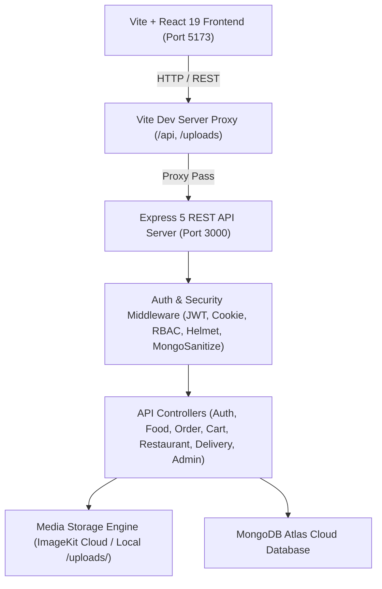

# 🍱 Zesty — Multi-Role Food Discovery & Instant Delivery Platform

Zesty is an enterprise-grade, video-first multi-role food discovery and hyper-fast delivery platform built with Node.js, Express 5, React 19, Vite, and MongoDB Atlas. It unifies Customers, Restaurant Partners, Delivery Riders, and Platform Admins into a cohesive, secure, real-time ecosystem.

---

## 🌟 Key System Capabilities

- **Video-First Reel Discovery**: Discover dishes through immersive short video reels and photo posts created directly by local restaurant partners.
- **Multi-Role Portal Isolation**: Dedicated role-based portals for **Customer**, **Restaurant Partner**, **Delivery Rider**, and **Super Admin** with strict portal cross-access guards.
- **Unified Authentication**: High-security authentication supporting Email/Password, OTP, and Google OAuth 2.0 with role-mismatch prevention.
- **Real-Time Order & Logistics Workflow**: Instant web-socket and polling updates tracking live order states (`Pending` ➔ `Preparing` ➔ `Ready for Pick Up` ➔ `Out for Delivery` ➔ `Delivered`).
- **Cloud & Local Storage Engine**: Hybrid media engine with ImageKit Cloud API integration and automatic local intact storage fallbacks (`/uploads/`) for zero binary corruption.
- **Transparent Order Pricing**: Detailed automated financial breakdowns calculating Food Subtotal, Packaging Charges (₹20), 5% GST Tax, Delivery Fees (₹40), 5% Platform Commission, and Net Partner/Rider Earnings.
- **Guest Cart & Seamless Merge**: Unauthenticated users can build guest carts stored in `localStorage`, which automatically merge into their database cart upon login.

---

## 🏗️ System Architecture Overview



---

## 📁 Repository Directory Structure

```text
Zesty/
├── ARCHITECTURE.md           # High-level architecture & system design specs
├── CHANGELOG.md              # Project version history and recent bug fixes
├── CONTRIBUTING.md           # Developer guidelines and workflow
├── README.md                 # Project root documentation & homepage
├── SECURITY.md               # Platform security policies & compliance
├── docs/                     # Detailed system documentation
│   ├── API_OVERVIEW.md       # Global API routes index
│   ├── ARCHITECTURE.md       # Deep-dive backend/frontend architecture
│   ├── AUTHENTICATION.md     # Password, JWT & Cookie session specification
│   ├── CART_FLOW.md          # Guest cart and authenticated cart merge logic
│   ├── DATABASE.md           # Mongoose schemas & Atlas relationship specs
│   ├── DEPLOYMENT.md         # Production deployment guide
│   ├── ENVIRONMENT_SETUP.md  # Environment variable reference
│   ├── GOOGLE_OAUTH.md       # Google OAuth 2.0 multi-role flow
│   ├── ORDER_FLOW.md         # Order lifecycle & state transitions
│   ├── PAYMENT_AND_COMMISSION.md # Financial calculations & commission ledger
│   ├── PROJECT_OVERVIEW.md   # Executive overview & design philosophy
│   ├── TROUBLESHOOTING.md    # Common issue fixes & debug steps
│   └── USER_ROLES.md         # Role-based access control (RBAC) matrix
├── backend/                  # Node.js + Express 5 Backend Engine
│   ├── nodemon.json          # Nodemon watcher configuration
│   ├── public/uploads/       # Local intact media storage directory
│   ├── server.js             # HTTP & Socket.io server entry point
│   ├── src/                  # Express app, routes, controllers, models
│   └── docs/                 # Backend-specific documentation
└── frontend/                 # React 19 + Vite Frontend SPA
    ├── vite.config.js        # Vite build and reverse proxy configuration
    ├── src/                  # Components, App views, styles
    └── docs/                 # Frontend-specific documentation
```

---

## ⚡ Quick Start Guide

### Prerequisites
- **Node.js**: v18.0.0 or higher
- **npm**: v9.0.0 or higher
- **MongoDB**: MongoDB Atlas Cluster connection URI

### 1. Backend Setup
```bash
cd backend
npm install
# Configure your environment variables in backend/.env
npm run dev
```
*Backend server runs on:* `http://localhost:3000`

### 2. Frontend Setup
```bash
cd frontend
npm install
# Configure your environment variables in frontend/.env
npm run dev
```
*Frontend application runs on:* `http://localhost:5173`

---

## 🔐 Environment Configuration

### Backend Environment (`backend/.env`)
```env
PORT=3000
MONGODB_URI=mongodb+srv://<username>:<password>@<cluster>.mongodb.net/zesty
JWT_SECRET=your_jwt_secret_key
COOKIE_SECRET=your_cookie_secret_key
VITE_GOOGLE_CLIENT_ID=your_google_oauth_client_id.apps.googleusercontent.com

# ImageKit Credentials (Optional - auto falls back to local /uploads/ if test keys used)
IMAGEKIT_PRIVATE_KEY=private_xxxxxxxx
IMAGEKIT_PUBLIC_KEY=public_xxxxxxxx
IMAGEKIT_URL_ENDPOINT=https://ik.imagekit.io/xxxxxxx
```

### Frontend Environment (`frontend/.env`)
```env
VITE_GOOGLE_CLIENT_ID=your_google_oauth_client_id.apps.googleusercontent.com
VITE_API_URL=/api
```

---

## 📚 Complete System Documentation Index

- 📖 **[System Architecture](ARCHITECTURE.md)**
- 📖 **[Project Overview](docs/PROJECT_OVERVIEW.md)**
- 📖 **[User Roles & RBAC Matrix](docs/USER_ROLES.md)**
- 📖 **[Authentication System](docs/AUTHENTICATION.md)**
- 📖 **[Google OAuth Integration](docs/GOOGLE_OAUTH.md)**
- 📖 **[API Overview](docs/API_OVERVIEW.md)**
- 📖 **[Database Schemas & ERD](docs/DATABASE.md)**
- 📖 **[Order Lifecycle Flow](docs/ORDER_FLOW.md)**
- 📖 **[Cart & Guest Merge Flow](docs/CART_FLOW.md)**
- 📖 **[Payment & Commission Ledger](docs/PAYMENT_AND_COMMISSION.md)**
- 📖 **[Frontend Documentation](frontend/README.md)**
- 📖 **[Backend Documentation](backend/README.md)**
- 📖 **[Troubleshooting Guide](docs/TROUBLESHOOTING.md)**
