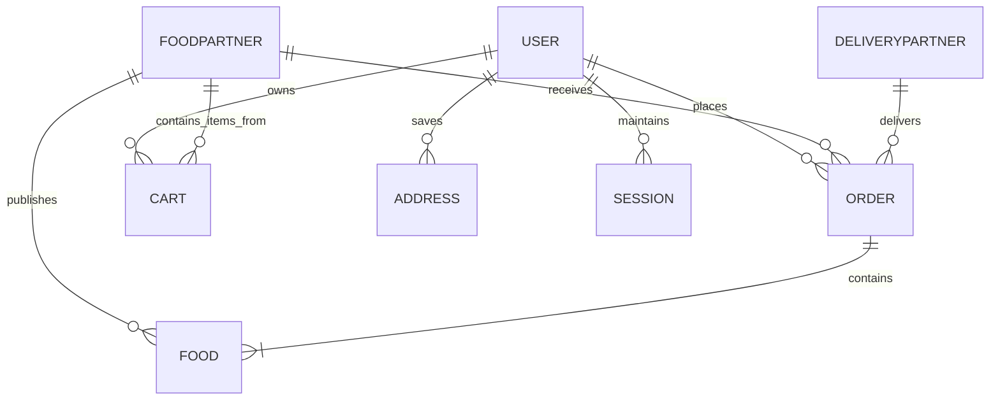

# 🗄️ Database Schemas & Entity Relationships — Zesty

Zesty uses MongoDB with Mongoose 9 ODM. Below is the Entity-Relationship structure.

---

## 📊 Entity Relationship Diagram (Mermaid)

---

## 📑 Collections & Models Overview

1. `users` (`userModel`)
2. `foodpartners` (`foodPartnerModel`)
3. `deliverypartners` (`deliveryPartnerModel`)
4. `admins` (`adminModel`)
5. `foods` (`foodModel`)
6. `carts` (`cartModel`)
7. `orders` (`orderModel`)
8. `addresses` (`addressModel`)
9. `sessions` (`sessionModel`)
10. `auditlogs` (`auditLogModel`)
